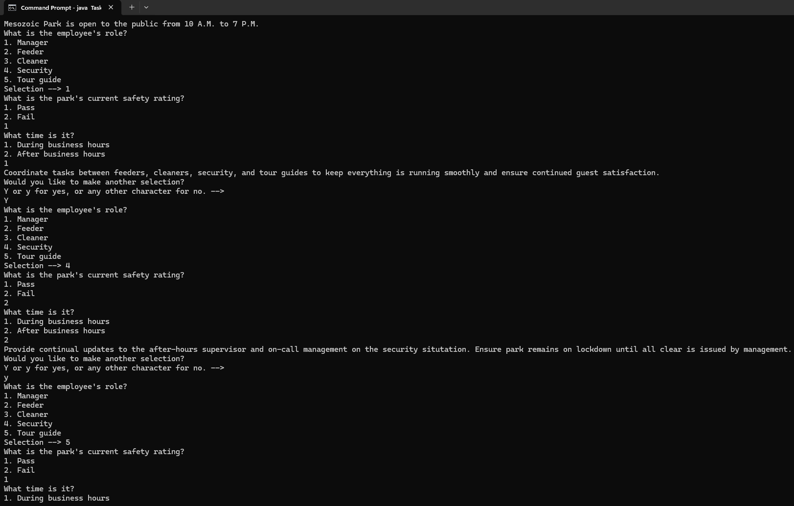

# Task-Allocation-System
A program in Java demonstrating conditional statements and iteration by assigning hypothetical tasks to employees of the fictional Mesozoic Eden Park.

## Table of contents
* [General Info](#General-info)
* [Author](#Author)
* [Programming Approaches](#Programming-approaches)
* [Techologies](#Technologies)
* [Setup](#Setup)
* [Usage](#Usage)
* [Minimum hardware requirements](#Minimum-hardware-requirements)
* [Screenshots](#Screenshots)
* [Project status](#Project-status)
* [Room for improvement](#Room-for-improvement)
* [Release date](#Release-date)
* [Sources](#Sources)
* [Contact](#Contact)

## General info
TaskAllocationSystem.java is a program I wrote in Java while reviewing this programming language to demonstrate the use of conditional statements and iteration. This is my solution to the Chapter 4 project prompt in the book Learn Java with Projects by Dr. Sean Kennedy and Maaike van Putten. Although it is only supposed to demonstrate conditional statements, I incorporated iteration concepts from Chapter 5 (since I'm an overachiever like that). I'm reviewing Java on my own, and not part of any official course curriculum, yet.

## Author
- Jason Ash, Computer Science Major

## Programming approaches
- I drew a quick and dirty flow-chart on a piece of paper before I began programming, which helps with maintaining good flow in the program and keeps coding on-task.

## Technologies:
I wrote the source code in Notepad in Windows 11, compiled it in the Command Prompt using the javac command, and ran it using the java command.

## Setup
To compile this .java file into Java bytecode, you can use the command line like I did or your favorite IDE of choice.

## Usage
After running the program, it will ask you to select one of five employee roles, 1 or 2 based on whether the park has passed or failed its safety rating, respectively, and 1 or 2 for during or after hours, respectively. It will then display to the user the hypothetical task delegated to this role based on the scenario.

## Minimum hardware requirements
Although I developed this on a fairly recent Windows 11 PC, this program should run comfortably on any working computer with sufficient processing power, RAM, a monitor manufactured within the past 15-20 years, and an Internet connection to download the .java source file. 

## Screenshots

## Project status
Since it satisfies the requirements of the Chapter 4 project in this book, I'm releasing my solution on GitHub.

## Room for improvement
- Perhaps more creative writing for the delegated task since the program output somewhat reads like a boring, short version of "Choose your own adventure" novel (if you have ever read one of those back in the day).
- Incorporating exception handling (which I'm just starting to use, even though it isn't covered until Chapter 11) in case the user enters something other than a number when prompted, the program doesn't crash.

## Release date
25 April, 2026

## Sources
This program is my solution to the "Project - Task allocation system prompt" at the end of Chapter 4 in the Learn Java with Projects book. I stuck with the default roles suggested by the authors of feeding, cleaning, security, and tour guides, and added manager. I also just went with a pass-fail for the security rating and two options for the time of day (during and after hours). This simplified the program a little since with white-space and brackets, it is already 285 lines long.

I created my flowcharts from scratch using miro.com. I edited them slightly with circles and letters in Microsoft Paint afterwards to clarify which branch goes to the next one, as the screenshots of my flowchart were captured in a series of approximately page-sized single .png files to be placed in my project documentation document.

## Contact
Jason Ash - wizardofki@gmail.com
